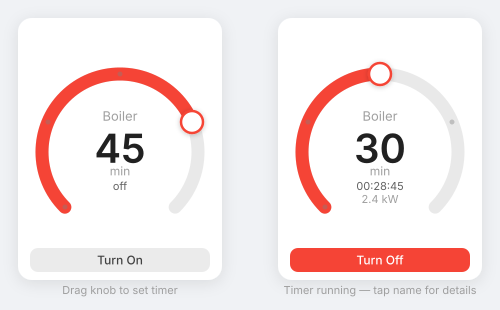
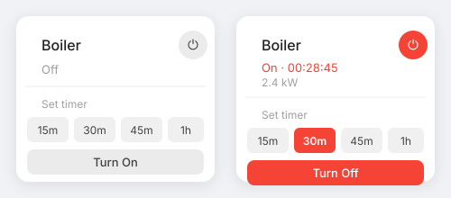

# switcher-boiler-dial-card

Two Home Assistant Lovelace cards for Switcher boilers — a **draggable circular timer dial** and a **tile card** with preset timer buttons.

Built to work with the official [Switcher Integration](https://www.home-assistant.io/integrations/switcher_kis/) for Home Assistant.

---

## Dial Card

Drag the knob clockwise to set a timer, just like the Switcher app. The device turns on the moment you let go. While the timer is running, the center shows a live countdown.



**Features:**
- Full 360° ring — drag clockwise from 12 o'clock to set a timer
- Multi-rotation: drag 1.5× for 90 min, 2× for 2 hours, etc.
- Configurable maximum timer limit
- Device turns on automatically when you release the knob
- Center shows set minutes while dragging, live `H:MM:SS` countdown when running
- Resets to 0 when the device is manually turned off
- State and optional power sensor shown together in one line (e.g. `on · 2.4kW`)
- Fully responsive — works in vertical stacks, grids, and on mobile

---

## Tile Card

The classic tile-style card with preset timer buttons.



**Features:**
- Power toggle, timer start, and cycling preset value — all in one row
- Optional secondary sensors displayed in the state line
- Optional icon sensor (e.g. water temperature) with color thresholds
- Configurable preset timer values

---

## Installation

### HACS (Custom Repository)

1. Open HACS in Home Assistant
2. Go to **Frontend** → click the three-dot menu (⋮) → **Custom repositories**
3. Add `https://github.com/Puuuchkie/switcher-boiler-dial-card` as type **Dashboard**
4. Search for "Switcher Boiler Dial Card" and install it
5. Reload your browser

### Manual

1. Download `switcher-boiler-dial-card.js` from the [`dist/`](dist/) folder
2. Copy it to `config/www/switcher-boiler-dial-card/switcher-boiler-dial-card.js`
3. Add it as a resource in your dashboard:
   - **UI:** _Settings_ → _Dashboards_ → _⋮_ → _Resources_ → _Add Resource_
     - URL: `/local/switcher-boiler-dial-card/switcher-boiler-dial-card.js`
     - Type: `JavaScript Module`
   - **YAML:**
     ```yaml
     resources:
       - url: /local/switcher-boiler-dial-card/switcher-boiler-dial-card.js
         type: module
     ```

---

## Configuration

Both cards are fully configurable from the HA UI editor. YAML options below.

### Dial Card

```yaml
type: custom:switcher-boiler-dial-card
entity: switch.switcher_touch_d54f
name: Boiler
time_left: sensor.switcher_touch_d54f_remaining_time
power_sensor: sensor.switcher_touch_d54f_power
timer_limit: 90
```

| Name | Description | Required | Default |
|---|---|---|---|
| `type` | `custom:switcher-boiler-dial-card` | yes | |
| `entity` | Switcher switch entity | yes | |
| `name` | Card name. Leave empty to use the entity's friendly name. | no | entity name |
| `time_left` | Remaining time sensor (`HH:MM:SS`). Shows live countdown in the center when the device is on. | no | |
| `power_sensor` | Power consumption sensor. Shown next to the state label when the device is on. | no | |
| `timer_limit` | Maximum settable timer in minutes. Limits how far the knob can be dragged. | no | `150` |

### Tile Card

```yaml
type: custom:switcher-boiler-tile-card
entity: switch.switcher_touch_d54f
name: Boiler
icon: mdi:waves
time_left: sensor.switcher_touch_d54f_remaining_time
sensor_1: sensor.switcher_touch_d54f_current
icon_sensor: sensor.switcher_water_temperature
color_thresholds: true
cold_threshold: 20
hot_threshold: 50
temp_resolution: 1
timer_values:
  - "15"
  - "30"
  - "45"
  - "60"
```

| Name | Description | Required | Default |
|---|---|---|---|
| `type` | `custom:switcher-boiler-tile-card` | yes | |
| `entity` | Switcher switch entity | yes | |
| `name` | Card name. Leave empty to use the entity's friendly name. | no | entity name |
| `icon` | Card icon. Leave empty to use the entity's icon. | no | `mdi:waves` |
| `time_left` | Remaining time sensor, shown in the state line when on. | no | |
| `sensor_1` | Extra sensor shown when the device is on. | no | |
| `sensor_2` | Extra sensor shown when the device is on or off. | no | |
| `icon_sensor` | Numeric sensor displayed as the card icon (e.g. water temperature). | no | |
| `color_thresholds` | Enable colour coding for the icon sensor value. | no | `false` |
| `cold_threshold` | Upper limit for the cold colour band. | no | `20` |
| `hot_threshold` | Lower limit for the hot colour band. | no | `50` |
| `temp_resolution` | Decimal places for the icon sensor value (0, 1, or 2). | no | `1` |
| `timer_values` | List of preset timer values in minutes (1–150). | no | `15, 30, 45, 60` |

---

## Development

```sh
npm install
npm run build      # produces dist/switcher-boiler-dial-card.js
npm run watch      # watch mode on port 4000
npm run start:hass # run Home Assistant in Docker at http://localhost:8123
```

---

## Credits

Inspired by and forked from [switcher-boiler-card](https://github.com/dmatik/switcher-boiler-card) by [Dmitry Trosman (dmatik)](https://github.com/dmatik).
